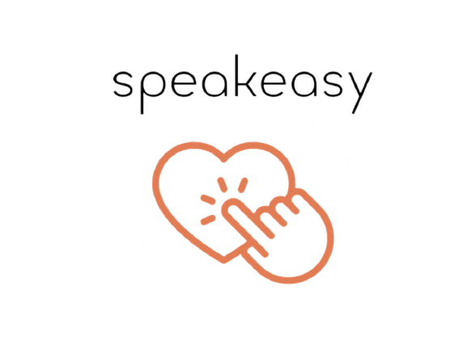
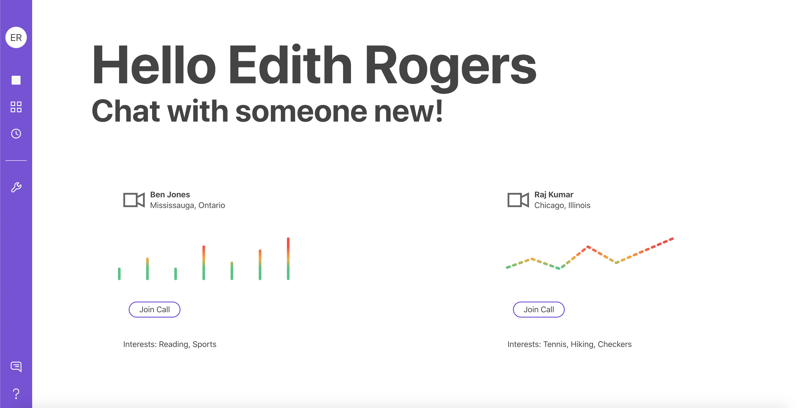

<h1 align="center">
   
  
   
</h1>

<h4 align="center">Getting seniors connected to a good conversation, anywhere in the world!</h4>
 

## Preview
 

  

## Inspiration

With the fast-pace of modern life, seniors have been relegated to the backseat for far too long. With the COVID-19 pandemic, seniors have become even more isolated from the rest of the world. Personally, as a generation that grew up on our smartphones, we've had little trouble transitioning to virtual communcation. However, the same can't be said for most of our elderly populations with only **27%** of those 65+ owning a smartphone as of 2017 (Canadian Journal of Communication Vol 42, p.g. 331). Our team set out to connect seniors to new people and new conversations on an accessable web platform.

## What it does

Our web application, SpeakEasy, lets seniors sign up for a timeslot/date after submitting very basic information (name, email, and interests). It then matches the senior with an available caller and transitions the two into a Zoom meeting where they can see each others interests. From there, the conversation goes where the wind blows!

## Tech Stack 

* React.js
* Node.js
* CockroachDB

## Challenges we ran into
- Creating a fast front-facing application
- Maintaining a clean database
- Creating robust links between database <--> backend <--> frontend

## What we learned
- CockroachDB and CockroachCloud
- Building a REST API
- Complex SQL Queries
- Integrating React with Node.js
- Building User Interfaces

## What's next for SpeakEasy
- Adding games to the platform
- Location based matching algorithm (i.e. people near me)
- Ability to add friends and group calls based on shared interests

